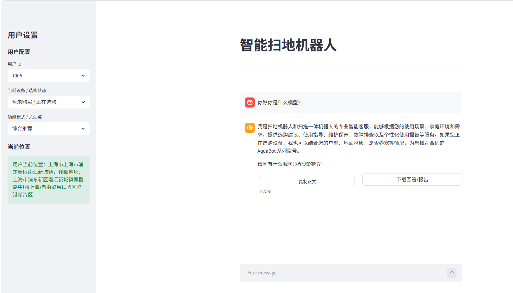

# 基于 LangChain 与 RAG 的智能扫地机器人售后问答系统

## 项目运行效果

智能扫地机器人 Agent 系统运行界面如下：



## 1. 项目简介

本项目是一个面向智能扫地机器人售后服务场景的智能问答系统。系统基于 Streamlit 构建前端交互界面，使用 LangChain Agent 组织大模型推理流程，并结合 Chroma 向量数据库实现本地知识库检索问答。

系统支持产品知识问答、故障排查、用户使用数据查询和月度报告生成等功能，可用于智能家居售后客服场景下的轻量级 AI Agent 应用。

## 2. 技术栈

- Python
- Streamlit
- LangChain
- LangGraph
- Chroma
- DashScope / 通义千问
- RAG
- YAML 配置管理
- Logging 日志模块

## 3. 核心功能

- 基于 Streamlit 搭建聊天式交互界面
- 基于 LangChain Agent 实现工具调用流程
- 支持 PDF/TXT 文档加载、切分和向量化存储
- 基于 Chroma 构建本地向量知识库
- 支持扫地机器人产品问答、维护建议和故障排查
- 支持用户使用记录查询
- 支持动态 Prompt 切换，实现月度使用报告生成
- 支持会话级短期记忆，保留最近 20 轮对话用于多轮追问理解
- 支持基于历史上下文的 RAG 查询改写，提升省略追问场景下的检索准确率
- 支持 RAG 检索来源展示，包含命中文档、片段摘要、metadata 和相似度分数
- 支持处理过程折叠展示，将工具调用过程与正式回答分离
- 支持回答正文复制和回答/报告 Markdown 下载
- 支持侧边栏配置用户 ID、当前设备/选购状态和功能模式/关注点，用于个性化问答、选购推荐与报告生成
- 支持日志记录、配置文件读取和统一路径管理

## 4. 项目结构

```text
Agent/
├── app.py
├── check_imports.py
├── agent/
│   ├── __init__.py
│   ├── react_agent.py
│   └── tools/
│       ├── __init__.py
│       ├── agent_tools.py
│       └── middleware.py
├── rag/
│   ├── __init__.py
│   ├── query_rewrite_service.py
│   ├── rag_service.py
│   └── vector_store.py
├── model/
│   ├── __init__.py
│   └── factory.py
├── Agent_project/
│   ├── __init__.py
│   └── utils/
│       ├── __init__.py
│       ├── config_handler.py
│       ├── file_handler.py
│       ├── logger_handler.py
│       ├── path_tool.py
│       └── prompt_loader.py
├── config/
├── prompts/
├── requirements.txt
├── .gitignore
└── README.md
```

## 5. 环境配置

### 1. 安装依赖

```bash
pip install -r requirements.txt
```

### 2. 配置 API Key

项目需要配置 DashScope API Key。

可以在系统环境变量中配置：

```env
DASHSCOPE_API_KEY=your_dashscope_api_key_here
```

如果需要使用浏览器定位、当前位置天气和高德 IP 定位兜底能力，还需要配置高德 Web 服务 Key：

```env
AMAP_WEB_KEY=your_amap_web_key_here
```

当前代码直接从系统环境变量读取 Key。若需要使用 `.env` 文件，需在启动入口中自行加载环境变量。

注意：`.env` 是本地敏感文件，不应上传到 GitHub。

## 6. 启动项目

在项目根目录下运行：

```powershell
cd E:\AI_LLM\Agent
& "E:\Anacoda\envs\torch311\python.exe" -m streamlit run app.py
```

如果已经激活了对应的 Conda 环境，也可以运行：

```powershell
streamlit run app.py
```

## 7. 整体运行流程

项目的主流程从 `app.py` 开始，由 Streamlit 接收用户输入，再交给 `ReactAgent` 执行。

```text
用户在 Streamlit 页面输入问题
        ↓
app.py 获取输入、定位信息和最近 20 轮短期记忆
        ↓
ReactAgent.execute_events(query, history_messages)
        ↓
LangChain Agent 根据系统提示词判断是否需要调用工具
        ↓
工具层执行 RAG 检索、天气查询、定位查询、用户数据查询等能力
        ↓
RAG 工具结合短期记忆对检索 query 进行改写
        ↓
模型结合用户问题、工具结果和检索资料生成回答
        ↓
app.py 将处理过程、正式回答和参考来源分区展示
```

其中 `ReactAgent` 是整个智能体的装配层，它把模型、Prompt、工具和中间件组合起来，不直接实现具体业务逻辑。

## 8. 模块说明

### app.py

项目前端入口，负责 Streamlit 页面展示、用户输入、聊天记录保存和流式输出。

该模块使用 `st.session_state["messages"]` 保存当前浏览器会话内的聊天历史，并通过 `MEMORY_TURNS = 20` 控制传给 Agent 的短期记忆轮数。短期记忆只保留 `user` 和 `assistant` 的正文内容，不会把处理过程、参考来源或 metadata 传入上下文。

侧边栏提供用户 ID、当前设备/选购状态和功能模式/关注点配置。用户 ID 会传入工具层，报告生成时优先使用侧边栏选择的用户；当前设备/选购状态和功能模式/关注点会作为当前请求上下文注入 Agent，用于生成更贴合设备状态的回答。

当前设备/选购状态支持两类场景：

- `暂未购买 / 正在选购`：用于选购推荐场景，Agent 会根据用户面积、宠物、老人、地面材质和清洁需求推荐合适型号。
- 具体设备型号：用于已有设备咨询场景，Agent 会围绕当前型号给出使用、维护、故障排查或报告建议。

页面展示结构如下：

```text
用户问题

处理过程（思考时实时展示，完成后折叠）

助手回答 / 报告正文

复制正文 / 下载回答或报告

参考来源（默认折叠）
```

### agent/react_agent.py

负责创建 LangChain Agent，并组织模型、工具和中间件的调用流程。

该模块中的 `ReactAgent` 类主要包含两个部分：

- `__init__()`：调用 `create_agent()` 创建智能体，注入聊天模型、系统提示词、工具列表和中间件。
- `execute_events(query, history_messages)`：接收用户问题和短期记忆，将 Agent 输出拆成处理过程事件和正式回答事件。
- `execute_stream(query)`：兼容旧的纯文本流式输出方式，只返回正式回答内容。

`create_agent()` 中的核心组成如下：

```text
chat_model
    来自 model/factory.py，当前使用 qwen3-max。

load_system_prompts()
    从 prompts/main_prompt.txt 读取普通问答场景下的系统提示词。

tools
    来自 agent/tools/agent_tools.py，包括 RAG 问答、天气查询、定位查询、用户数据查询和报告上下文触发工具。

middleware
    来自 agent/tools/middleware.py，包括工具调用监控、模型调用前日志记录和动态 Prompt 切换。
```

`ReactAgent` 的执行链路如下：

```text
app.py
  └── ReactAgent.execute_events(user_prompt, history_messages)
        └── self.agent.stream(...)
              ├── 模型判断是否需要调用工具
              ├── 调用 agent_tools.py 中的具体工具
              ├── middleware.py 记录工具调用和模型调用日志
              ├── 将模型判断、工具调用和工具结果输出为处理过程
              └── 返回最终回答正文
```

当用户要求生成使用报告时，Agent 会调用 `fill_context_for_report` 工具。该工具被中间件捕获后，会将运行时上下文中的 `report` 标记改为 `True`，随后 `report_prompt_switch` 会自动切换到 `prompts/report_prompt.txt`，让同一个 Agent 从普通问答模式切换到报告生成模式。

### agent/tools/agent_tools.py

封装业务工具函数，包括知识库问答、天气查询、用户位置查询、使用记录查询和报告上下文触发工具。

其中 RAG 工具会读取当前短期记忆上下文，先通过查询改写服务将省略追问补全为完整检索 query，再调用 RAG 服务生成回答。最近一次查询改写结果会传回页面，展示在“处理过程”折叠区中。

### agent/tools/middleware.py

封装 Agent 中间件逻辑，包括工具调用监控、模型调用前日志记录和动态 Prompt 切换。

### rag/rag_service.py

负责 RAG 问答流程，将用户问题与检索到的参考资料共同输入模型生成回答，并记录本轮检索命中的来源信息，供前端展示。

### rag/query_rewrite_service.py

负责 RAG 查询改写。该模块会读取最近几轮短期记忆，将“那有宠物呢？”、“这个怎么保养？”这类依赖上下文的追问改写成完整检索 query，再交给向量库检索。

示例：

```text
历史问题：大户型适合什么扫地机器人？
当前追问：那有宠物呢？
改写结果：大户型且有宠物家庭适合什么扫地机器人？
```

### rag/vector_store.py

负责本地知识库构建，包括文档加载、文本切分、向量化存储和检索器创建。

### model/factory.py

负责封装聊天模型和 Embedding 模型的创建逻辑。

### Agent_project/utils/

负责配置读取、路径管理、文件加载、日志记录和 Prompt 加载等基础工具能力。

## 9. 项目亮点

- 将普通大模型问答与本地知识库检索结合，提高回答的业务相关性。
- 使用 LangChain Agent 封装多工具调用流程，支持用户信息、外部数据和知识库的动态调用。
- 支持会话级短期记忆，保留最近 20 轮上下文，使系统能够理解多轮追问和指代表达。
- 实现基于短期记忆的 RAG 查询改写，在省略追问场景下补全检索 query，提高向量检索命中质量。
- 通过中间件实现动态 Prompt 切换，使普通问答和报告生成可以使用不同的提示词策略。
- 支持 RAG 检索来源追踪，展示命中文档、片段摘要、metadata 和相似度分数，提高回答可解释性。
- 将处理过程、正式回答和参考来源分区展示，既保留 Agent 推理过程可观察性，又避免干扰主体回答。
- 支持回答正文复制和报告 Markdown 下载，方便用户保存售后建议或月度报告。
- 支持用户 ID、当前设备/选购状态和功能模式/关注点配置，使问答、选购推荐和报告生成具备基础个性化能力。
- 使用 YAML 配置管理、日志模块和统一路径工具，提高项目可维护性。
- 基于 Streamlit 实现可交互页面，支持流式响应和历史对话展示。

## 10. 后续优化方向

- 将随机模拟工具改为基于 CSV 或 SQLite 的真实用户数据查询。
- 增加扫地机器人故障代码诊断模块。
- 增加清空短期记忆按钮，避免不同咨询主题之间的上下文污染。
- 增加知识库状态展示和一键重建能力，方便检查 Chroma 向量条数和文档导入状态。
- 增加问答测试集，对检索命中率和响应耗时进行评估。
- 增加报告下载功能，支持导出月度使用报告。
- 优化前端页面，进一步增加预算、房屋面积、是否养宠、地面材质等选购推荐参数。
